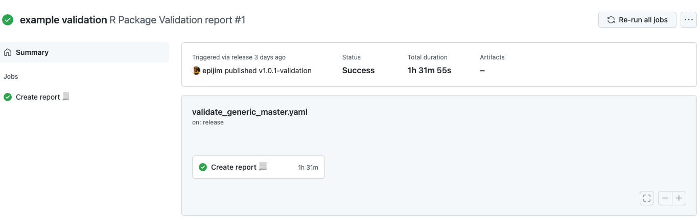
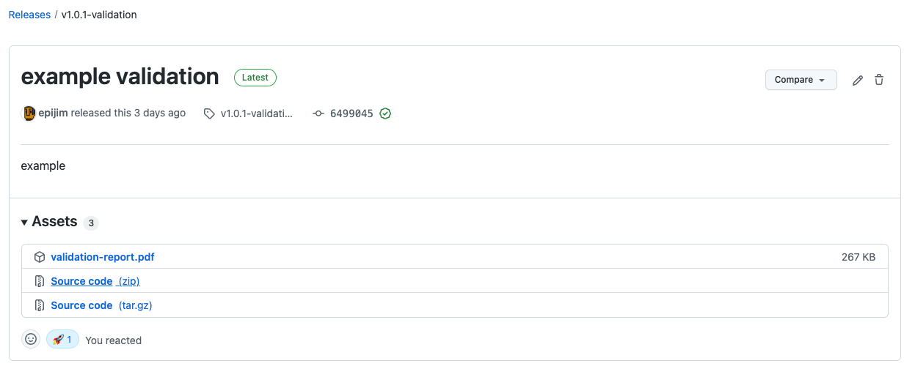

# thevalidatoR

 

[](https://pharmaverse.org)
[](https://github.com/insightsengineering/thevalidatoR/actions/workflows/lint.yaml)
[](https://github.com/insightsengineering/thevalidatoR/actions/workflows/test.yaml)

- [An R Package Validation Report](#an-r-package-validation-report)
    - [Description](#description)
    - [Action Type](#action-type)
    - [Author](#author)
    - [Inputs](#inputs)
    - [Outputs](#outputs)
  - [How to use](#how-to-use)
    - [Quickstart](#quickstart)
    - [V1.0 Examples](#v10-examples)
      - [rbmi](#rbmi)
      - [admiral](#admiral)

<!-- BEGIN_ACTION_DOC -->
# An R Package Validation Report

### Description

A Github Action that generates a validation report for an R package. The four main steps are:

- Run `R CMD check` (check installation)
- Run `covr::package_coverage()` (check unit test coverage)
- Run `covtracer` (link documentation to unit tests)
- Place results into report
- _If valtools present - run valtools and also publish report?_ (to discuss)
- Attach report as object to release

### Action Type

Composite

### Author

Roche

### Inputs

- `report_pkg_dir`:

  _Description_: Path to package's root

  _Required_: `false`

  _Default_: `.`

- `report_template_path`:

  _Description_: File path of the R markdown template to use for the report. The default template is available [here.](./template.Rmd)

  _Required_: `false`

  _Default_: `template.Rmd`

- `report_rmarkdown_format`:

  _Description_: The output format to use when rendering the report. Value is used by `rmarkdown::render`'s `output_format` parameter.

  _Required_: `false`

  _Default_: `pdf_document`

- `report_output_prefix`:

  _Description_: The output filename prefix for the validation report. If left blank, it defaults to the following convention: `<package name>-<package version>-validation-report`.

  _Required_: `false`

  _Default_: `""`

- `additional_tlmgr_packages`:

  _Description_: Additional tex packages to install with tlmgr.

  _Required_: `false`

  _Default_: `courier ec`

- `no_cache`:

  _Description_: Disable github action R dependency caching.

  _Required_: `false`

  _Default_: `false`

- `cache_version`:

  _Description_: Version of the cache. To clean cache bump this version.

  _Required_: `false`

  _Default_: `v1`

- `disable_install_dev_deps`:

  _Description_: Disable installation of dev dependencies while building the report.

  _Required_: `false`

  _Default_: `false`

### Outputs

- `report_output_filename`:

  _Description_: Filename of the generated report.

<!-- END_ACTION_DOC -->

## How to use

To use this GitHub Action you will need to complete the following:

- Create a new file in your repository called `.github/workflows/r-pkg-validation.yml`
- Copy the template over (and edit if you wish to modify it)

### Quickstart

In your repository you should have a `.github/workflows/validatoR.yml` file with GitHub Action similar to below:

```yaml
---
name: R Package Validation report

on: # Run this action when a release is published
  release:
    types: [published]

jobs:
  r-pkg-validation:
    name: Create report 📃
    runs-on: ubuntu-latest
    container:
      image: rocker/verse:4.1.1
    # Set Github token permissions
    env:
      GITHUB_PAT: ${{ secrets.GITHUB_TOKEN }}
    permissions:
      contents: write
      packages: write
      deployments: write
    steps:
      - name: Checkout repo 🛎
        uses: actions/checkout@v4

      - name: Build report 🏗
        id: validation
        uses: insightsengineering/thevalidatoR@main
        # see parameters above for custom templates and other formats

      # Upload the validation report to the release
      - name: Upload report to release 🔼
        if: success()
        uses: svenstaro/upload-release-action@v2
        with:
          file: ${{ steps.validation.outputs.report_output_filename }}
          asset_name: ${{ steps.validation.outputs.report_output_filename }}
          repo_token: ${{ secrets.GITHUB_TOKEN }}
          tag: ${{ github.ref }}
          overwrite: false
```

### V1.0 Examples

#### rbmi

You can see an example report from [rbmi](https://github.com/insightsengineering/rbmi), using the first version of this gh-action, [here](readme_files/report-1.0.1-rbmi.pdf).

This was built as a test on a fork of the original rbmi package. When we created a release in that fork, this PDF was automatically built and added to the release as can be seen below.



And you can see the gh-action action that was triggered by the release being published. Note that it must install the package, run tests and
construct the metrics needed by cov-tracer and covr, which in the case of `rbmi` a computationally heavy package - took quite a while!



#### admiral

You can see an example report from [admiral](https://github.com/Roche-GSK/admiral), using the first version of this gh-action, [here](readme_files/report-0.1-admiral.pdf).
